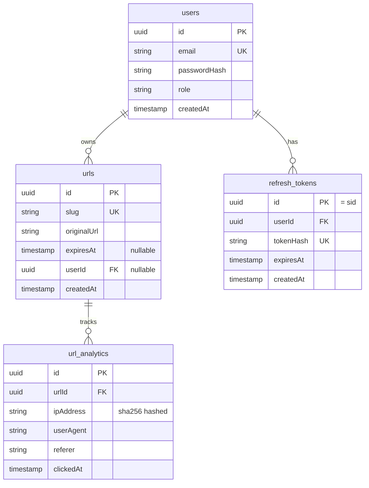

# URL Shortener REST API

🔗 **[Live Demo](https://lin-k.up.railway.app/BCS58c/)**

> API docs available locally at `http://localhost:3000/api/docs` — disabled in production.

A production-grade URL Shortener REST API built with NestJS, PostgreSQL, and Redis — designed with clean architecture, real system design thinking, and production-ready patterns throughout.

---

## Business Logic

### Guest User
- Can shorten any URL — no account required
- Generated link expires automatically after **7 days**
- No ownership — once created, the link cannot be edited or deleted
- Subject to strict rate limits (3/min, 20/hr, 50/day)
- No analytics access

### Authenticated User
- Links are owned — can be updated, deleted, or extended at any time
- Optional custom slug on creation
- Optional expiry — set a specific date or leave permanent
- Full click analytics per link — clicks over time, unique visitors, referrers, browsers, devices
- Higher rate limits (20/min, 100/hr, 500/day)
- Refresh token rotation — single-device logout via session ID

### URL Lifecycle

```
Guest creates link → 7-day TTL set → redirect works → TTL expires → cron purges it

User creates link → owned, permanent by default → redirect works → user deletes or updates
                                                                  → or sets expiry → cron purges after expiry
```

---

## Features

- URL shortening for guests and authenticated users with differentiated limits
- Custom slugs for authenticated users
- Optional URL expiry with nullable `expires_at` — no redundant boolean column
- Fast slug-based redirect with Redis cache-aside pattern
- Sliding TTL for permanent URLs — hot links stay warm in cache indefinitely
- Full click analytics — total clicks, unique visitors, clicks by day, top referrers, browser and device breakdown
- JWT auth with access and refresh token rotation via HttpOnly cookies
- Role-based access control, secure by default — every route protected unless explicitly public
- Multi-tier rate limiting — burst, hourly, and daily windows simultaneously
- Automated daily cleanup — expired URLs and refresh tokens purged in batches
- Swagger documentation at `/api/docs` (non-production only)

---

## Architecture

### Layer Separation

| Layer | Responsibility |
|---|---|
| Controller | Input validation, routing, response shaping — nothing else |
| Service | Business logic, orchestration, HTTP exceptions |
| Repository | Data access only — throws domain errors, never HTTP exceptions |

Controllers handle nothing beyond routing. Services never touch the database directly. Repositories never throw HTTP exceptions. Each layer has one job and one direction of dependency.

---

## Key Design Decisions

### `scrypt` over `bcrypt`
Password hashing uses Node's native `crypto.scrypt` with `timingSafeEqual` for constant-time comparison. `scrypt` is memory-hard, making it significantly more resistant to GPU brute-force attacks than `bcrypt` — and requires no external dependency.

### Refresh Token Rotation with `sid`
Each refresh token row has a UUID primary key (`sid`). That UUID is embedded in the access token payload alongside `userId` and `role`. On logout, the `sid` from the access token is used to delete the exact session row — enabling single-device logout without needing the refresh token cookie to be present.

### Secure by Default
`JwtAuthGuard` is registered globally. Every endpoint requires authentication unless explicitly decorated with `@Public()`. A third auth state `@OptionalAuth()` exists for `POST /urls` — runs JWT validation if a token exists, does not reject if missing.

### Cache-Aside Pattern
On every redirect: check Redis first. On a hit, return immediately and trust Redis TTL. On a miss, query PostgreSQL, populate cache, return. No redundant expiry check on cache hit — if the key exists, it is valid by definition. Redis failures are caught and logged — the system degrades gracefully to database-only reads without crashing requests.

### Multi-Tier Rate Limiting
Three simultaneous sliding windows prevent both burst abuse and sustained low-and-slow abuse:

| Tier | Window | Global Limit |
|---|---|---|
| Short | 1 minute | 30 requests |
| Medium | 1 hour | 500 requests |
| Long | 24 hours | 2000 requests |

`POST /urls` applies differentiated limits per user type:

| User Type | Per Minute | Per Hour | Per Day |
|---|---|---|---|
| Guest | 3 | 20 | 50 |
| Authenticated | 20 | 100 | 500 |

Sensitive endpoints like login and register have tighter dedicated limits with longer block durations to slow credential stuffing attacks.

Tracker key: `userId` for authenticated users, `req.ip` for guests. Express `trust proxy` is enabled so `req.ip` resolves correctly behind a reverse proxy.

### Atomic Slug Generation
Slug uniqueness is enforced via a database unique constraint. Generation uses insert-and-catch rather than check-then-insert — eliminating the race condition window that exists between a read and a write.

### Analytics — DB-Side Processing
Browser and device categorization happens entirely in PostgreSQL via `CASE` expressions — no external user-agent parsing library. `TO_CHAR` is used for date grouping to prevent server-to-client timezone shifting bugs in time-series data. IP addresses are SHA-256 hashed before storage for privacy compliance.

### Composite Index on Analytics
The analytics table indexes `(urlId, clickedAt)` — `urlId` first as the equality filter, `clickedAt` second as the range filter. Every analytics query filters by `urlId`, so PostgreSQL jumps directly to the relevant rows and scans them in date order without a separate sort pass.

### Config — No `process.env` in Application Code
All environment variables are validated at startup via a Joi schema. If a required variable is missing or invalid, the application refuses to start. `process.env` is only used in `typeorm.config.ts`, which runs outside the NestJS container for CLI migrations — keeping the CLI boundary clean from the DI system.

---

## Database Design


**Key decisions:**
- `tokenHash` — lookup key for refresh requests, not `userId`.
- `(urlId, clickedAt)` — composite for analytics. `urlId` first (equality), `clickedAt` second (range).
- `expiresAt` on refresh tokens — cron runs `WHERE expiresAt < NOW()` every midnight.
- `userId` on URLs — every authenticated `GET /urls` filters by this. Most frequent query in the system.

---

## Scheduled Jobs

| Job | Schedule | What it does |
|---|---|---|
| URL cleanup | Daily at midnight | Purges all expired URLs in batches of 1000 |
| Token cleanup | Daily at midnight | Purges all expired refresh tokens in batches of 1000 |

Batch deletion prevents full table locks on large datasets. Both jobs log total rows deleted and catch errors without crashing the scheduler.

---

## API Endpoints

Full interactive documentation at `http://localhost:3000/api/docs`

### Auth
| Method | Endpoint | Auth | Description |
|---|---|---|---|
| POST | `/auth/register` | Public | Register new user |
| POST | `/auth/login` | Public | Login, receive tokens as HttpOnly cookies |
| POST | `/auth/refresh` | Cookie | Rotate both tokens |
| POST | `/auth/logout` | Public* | Invalidate session |

*Logout silently verifies the access token to extract `sid` for targeted session deletion.

### URLs
| Method | Endpoint | Auth | Description |
|---|---|---|---|
| POST | `/urls` | Optional | Create short URL |
| GET | `/urls` | Required | List authenticated user's URLs |
| GET | `/urls/:id` | Required | Get URL by ID |
| PATCH | `/urls/:id` | Required | Update URL |
| DELETE | `/urls/:id` | Required | Delete URL |
| GET | `/:slug` | Public | Redirect to original URL |
| GET | `/urls/:id/analytics` | Required | Get click analytics |

---

## Security Highlights

- Passwords hashed with `scrypt` — memory-hard, GPU-resistant, no external dependency
- HttpOnly cookies — tokens never exposed to JavaScript
- `secure` cookie flag enabled in production
- Refresh token cookie scoped to `path: '/auth/refresh'` — not sent on every request
- IP hashing with SHA-256 before analytics storage — GDPR-aware
- Rate limiting with block durations on auth endpoints — slows credential stuffing
- Swagger disabled in production
- No `process.env` access in application code — Joi validates all vars at startup

---

## Tech Stack

| Layer | Technology |
|---|---|
| Framework | NestJS 11 |
| Database | PostgreSQL via TypeORM |
| Cache | Redis via `@keyv/redis` |
| Rate Limiting | `@nestjs/throttler` with Redis storage |
| Auth | JWT (access + refresh tokens), `scrypt` |
| Scheduling | `@nestjs/schedule` |
| Docs | Swagger / OpenAPI |
| Containerization | Docker + Docker Compose |

---

## Getting Started

### Prerequisites
- Docker and Docker Compose
- Node.js 20+

### Setup

```bash
git clone <repo-url>
cd url-shortener
cp .env.example .env
docker compose up -d
npm install
npm run migration:run
npm run start:dev
```

### Docker Services

| Service | Port | Description |
|---|---|---|
| PostgreSQL | 5432 | Primary database |
| Redis | 6379 | Cache + rate limiting |
| Redis Commander | 8081 | Redis visual inspector |

### Migrations

```bash
npm run migration:run       # run all pending migrations
npm run migration:generate  # generate migration from entity changes
```

| Migration | Description |
|---|---|
| `InitialSchema` | Users, URLs, analytics, tags base schema |
| `AddRefreshTokens` | Refresh token table with FK and expiry |
| `RefreshTokensAddIndexOnToken` | Unique index on `tokenHash` |
| `RefreshTokensAddIndexOnExpiresAt` | Index on `expiresAt` for cron queries |
| `CompositeIndexOnAnalytics` | Composite index on `(urlId, clickedAt)` |

> `synchronize: false` in all environments. All schema changes go through versioned migrations.

---

## Challenges

### Single-Window Rate Limiting — Exploitable by Patient Bots
A single rate limit window (e.g. 30 requests per minute) can be gamed: a bot that sends 29 requests per minute stays under the limit indefinitely while still causing significant load. The fix was multi-tier rate limiting — three simultaneous sliding windows (per minute, per hour, per day) applied at the same time. A bot that respects the per-minute cap will eventually hit the hourly or daily cap, and each tier has its own block duration that compounds the penalty. Burst abuse and sustained low-and-slow abuse are now both covered by the same guard.

### Sliding TTL for Hot Links
Permanent URLs (no `expiresAt`) would eventually expire from Redis cache after 24 hours of inactivity, forcing a database hit on the next redirect. The fix was a sliding TTL — every cache hit on a permanent URL resets the TTL back to 24 hours. Links that are actively being clicked stay warm in cache indefinitely. Links that go cold for 24 hours naturally evict themselves, freeing memory without manual intervention. Expiring URLs are excluded from this behavior — their TTL is calculated once from `expiresAt` and never extended.

### Circular Dependency — Analytics and URLs
`AnalyticsService` needed to verify a URL existed before returning analytics, which required calling `UrlsService`. But `UrlsService` already called `AnalyticsService` for click tracking — creating a circular dependency. The fix was restructuring responsibility: the controller now handles URL existence validation by calling `UrlsService.findById` first, then passes the full entity into `AnalyticsService`. `AnalyticsService` became dependency-free outside its own module. `forwardRef` was removed entirely.

### `IsOptionalButNotNull` Custom Decorator
`class-validator`'s `@IsOptional()` silently accepts `null` as a valid value — it treats `null` and `undefined` as equivalent. For fields like `expiresAt` on update, the requirement was "field can be omitted, but if provided, must not be null." A custom `@IsOptionalButNotNull()` decorator was built to skip validation only when the value is `undefined`, while still rejecting `null`. This prevented a subtle data integrity bug where clients could accidentally wipe expiry dates by passing null.

### Race Condition in Slug Generation
The naive approach — check if a slug exists, then insert — has a race condition window: two concurrent requests can both pass the existence check before either commits. The fix was atomic insert-and-catch: attempt the insert directly and catch the database `UniqueViolation` error, regenerating the slug and retrying. The database constraint becomes the single source of truth.

### Rate Limiting Tracker for Mixed Auth Routes
`POST /urls` accepts both guest and authenticated requests. The rate limiter needed to track guests by IP and authenticated users by `userId` — but a single global guard handles all routes. The solution was a custom `ThrottlerGuard` that overrides `getTracker()` to return `userId` when `req.user` is populated and falls back to `req.ip` for guests. This required `JwtAuthGuard` to run before `ThrottlerGuard` in the guard execution order.

### IP Spoofing via `X-Forwarded-For`
Manual parsing of the `X-Forwarded-For` header in the throttler guard was vulnerable — an attacker could inject a fake IP string to bypass rate limits. The fix was enabling Express `trust proxy` via `app.set('trust proxy', 1)` on `NestExpressApplication`, then using `req.ip` exclusively. Express handles the header chain correctly, selecting the rightmost untrusted IP rather than trusting the leftmost client-supplied value.
